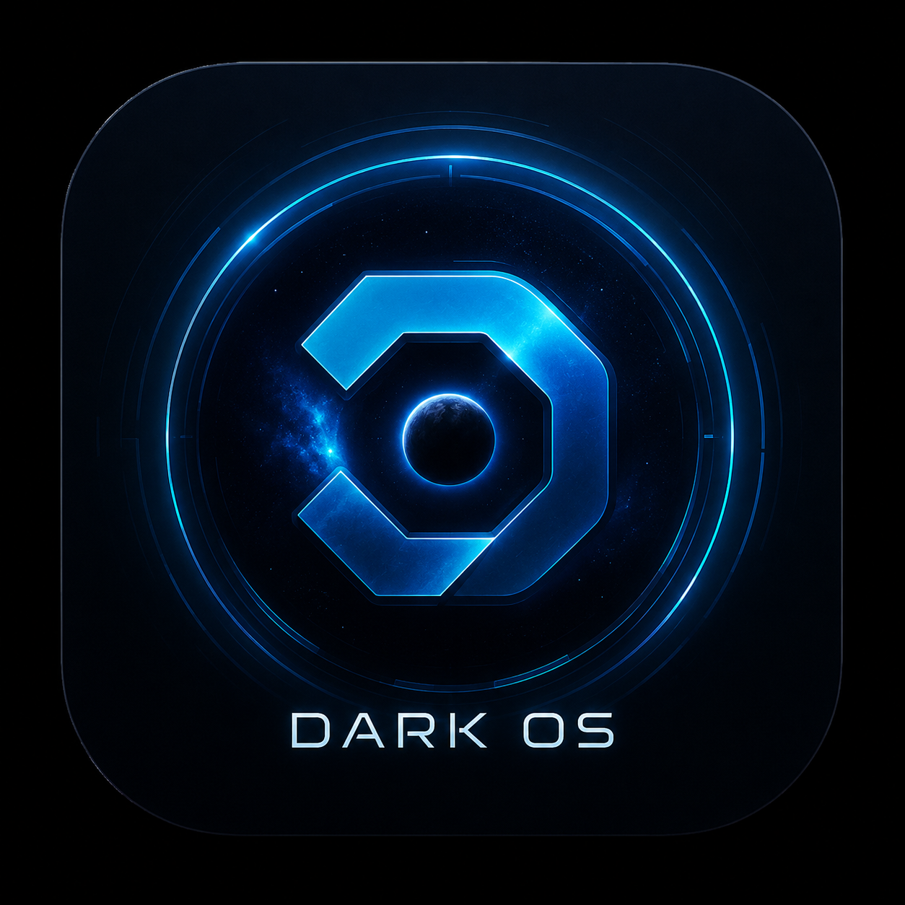
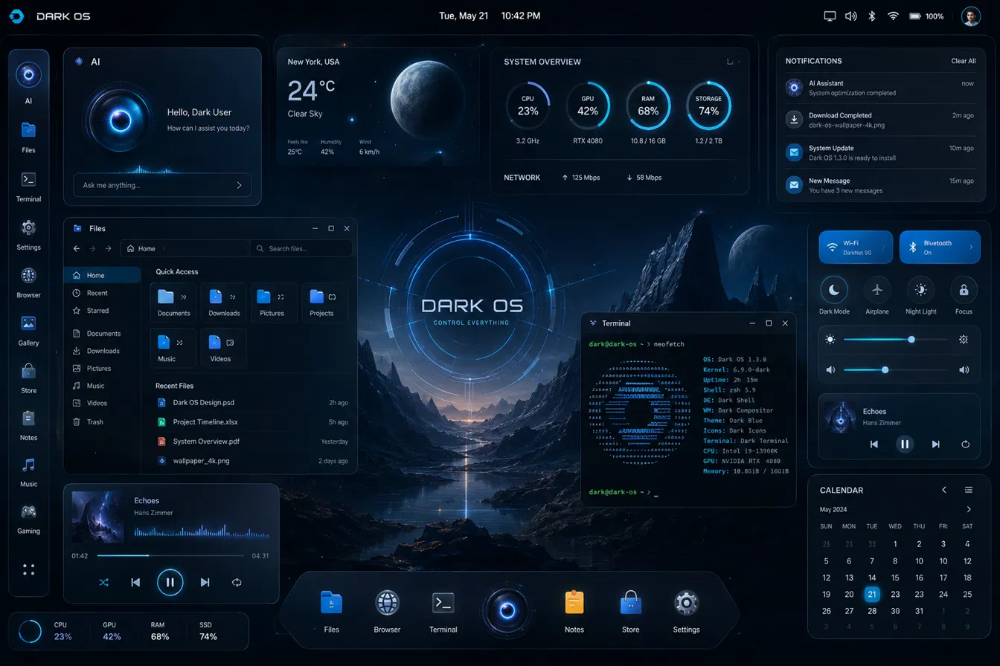

<p align="center">
  
</p>

<h1 align="center">DarkOS</h1>
<p align="center"><strong>Control Everything.</strong> An original, AI-first Linux OS.</p>

<p align="center">
  <em>Arch respin + BlackArch security tools + Hyprland compositor + cinematic glassmorphism shell + voice-controlled AI assistant</em>
</p>

---

DarkOS is a real startup product — not a demo, not a theme pack, not a Windows/macOS clone. It combines a daily-drivable Arch Linux base with a cinematic glassmorphism/HUD desktop environment and a voice assistant that can see, hear, and control the whole system.

## Features

- **Arch Linux under the hood** — rolling releases, pacman + AUR, full software ecosystem
- **BlackArch layered in** — 2,900+ security tools available as opt-in groups at install time
- **Hyprland compositor** — Wayland-native, GPU-accelerated, tiling + floating, spring animations, blur and rounded corners
- **Cinematic glassmorphism shell** — pure black backgrounds, glass panels with `backdrop-filter: blur(24px)`, electric cyan `#00e5ff` primary, neon blue `#2d7bff` secondary
- **Voice-controlled AI assistant** (in development) — STT/TTS/brain, OS control via D-Bus + `hyprctl`, generic in-app control via AT-SPI
- **~27 native apps** (Settings hub, File Explorer, Terminal, Notes, Calendar, etc.) + unmodified hosted software (Firefox, mpv, Docker, Steam)
- **Calamares graphical installer**
- **Windows compatibility** via Wine 11 / Bottles / Proton / QEMU/KVM

## Desktop Preview

<p align="center">
  
</p>

*Top bar, AI Core HUD, floating glass panels, left icon rail, and dock — running on Hyprland.*

## Quick Start

### Build the ISO

Requires `archiso` and `mkinitcpio` on an Arch Linux system or privileged container.

```bash
git clone https://github.com/Darkness0258/Dark-OS.git
cd Dark-OS
sudo bash build-iso.sh
```

Output is written to `out/darkos-*.iso`.

After verification, the build also refreshes `out/darkos.iso`. This stable
path is what the VMware test machine uses, so it always points to the most
recent verified build rather than a stale installer image.

### Run in a VM

```bash
cp /usr/share/edk2/x64/OVMF_VARS.4m.fd /tmp/darkos-vars.fd
qemu-system-x86_64 -m 4096 -enable-kvm -cdrom out/darkos.iso \
  -drive if=pflash,format=raw,readonly=on,file=/usr/share/edk2/x64/OVMF_CODE.4m.fd \
  -drive if=pflash,format=raw,file=/tmp/darkos-vars.fd
```

UEFI boot only — the live ISO boots via systemd-boot. Calamares installs GRUB in the target system; `darkos-grub-repair` retries it on the first installed boot only when the verified completion marker is absent.

### Launch the Installer

On a booted live system, open a terminal (Super+Q) and run:

```bash
sudo QT_QPA_PLATFORM=wayland XDG_RUNTIME_DIR=/run/user/1000 WAYLAND_DISPLAY=$WAYLAND_DISPLAY QT_QUICK_BACKEND=software calamares
```

## Project Structure

```
├── airootfs/                    # Files baked into the live ISO
│   ├── etc/
│   │   ├── xdg/hypr/hyprland.conf   # Hyprland compositor config
│   │   ├── xdg/waybar/              # Waybar config + CSS
│   │   ├── calamares/               # Installer module configs
│   │   ├── fastfetch/config.jsonc   # System info display
│   │   ├── passwd, group, shadow    # Live session user (darkos, passwordless)
│   │   ├── sudoers.d/darkos         # Passwordless sudo (live session)
│   │   └── systemd/system/          # Boot services (autologin, seatd, grub-repair)
│   ├── usr/
│   │   ├── local/bin/               # the-void.sh, darkos-tty1-login, darkos-grub-install.sh
│   │   └── share/
│   │       ├── applications/the-void.desktop  # Branded terminal launcher
│   │       └── calamares/branding/darkos/     # Installer slideshow + icon
│   └── home/darkos/.bash_profile    # Auto-starts Hyprland on TTY1
├── packages.x86_64              # Packages installed in the ISO
├── pacman.conf                  # Repository configuration
├── profiledef.sh                # archiso profile metadata
├── build-iso.sh                 # Local build wrapper
├── architecture.md              # Stack, app catalog, AI control design
├── build-plan.md                # 8-phase phased roadmap
├── project-overview.md          # Product vision and success criteria
├── ui-tokens.md                 # Design tokens (colors, spacing, type)
├── ui-rules.md                  # Layout and motion conventions
└── .github/workflows/build-iso.yml  # CI pipeline (GitHub Actions)
```

## Design System

| Token | Value | Usage |
|---|---|---|
| Primary | `#00e5ff` | Accents, brand elements, active borders |
| Secondary | `#2d7bff` | Module UI, secondary highlights |
| Background | `#000000` | Pure black base |
| Surface | `rgba(255,255,255,0.06)` | Glass panel fill |
| Body face | Inter, SF Pro Display | UI text |
| Display face | Space Grotesk | Headings, logo |
| Corner radius | 16px | Panels, dialogs |

Full specs in [ui-tokens.md](ui-tokens.md) and [ui-rules.md](ui-rules.md).

## Architecture & AI Control

See [architecture.md](architecture.md) for the complete design. Key principles:

- **OS-level AI control** via D-Bus + `hyprctl` (volume, brightness, workspaces, launching apps)
- **In-app AI control** via AT-SPI (Linux accessibility API) — reads and acts on any app's UI generically
- **Screen understanding** via periodic screenshots + vision model
- The visual shell never blocks on the AI backend
- Hosted apps (browser, media player, containers) are never modified — visual consistency comes from Hyprland's compositor-level decorations

## Roadmap

| Phase | Goal |
|---|---|
| 1 | Bootable Arch + Hyprland + BlackArch ISO ✓ |
| 2 | Core shell chrome (HUD, panels, dock) |
| 3 | AI assistant (STT/TTS/brain, OS control) |
| 4 | Daily-use native apps |
| 5 | System management (Settings, Network, Security) |
| 6 | Store & DevHub |
| 7 | Hosted apps, Mail, Gaming |
| 8 | Distributable (real hardware, onboarding) |

Full details in [build-plan.md](build-plan.md).

## Status

- **Phase 1 is building** — CI produces bootable ISOs published as GitHub Releases (main branch only)
- **Calamares installer** runs its guarded bootloader wrapper after partitioning, unpackfs, and user setup. It invokes `darkos-grub-install.sh` through Bash in the target chroot; the first-boot service is a marker-gated fallback.
- **Not yet verified:** the installed system booting after install — inspect `/boot/grub/install.log` and `/var/lib/darkos-grub-repair.done` after the first installed boot
- **Phase 2 shell** (HUD, panels, dock, lock screen) is the next milestone

Known risks and edge cases are documented in [CLAUDE.md](CLAUDE.md) (internal, for AI tooling).

## License

Licensing review is in progress. DarkOS builds on GPL and other open-source components (Arch Linux, Hyprland, Calamares, BlackArch). Source availability obligations will be honored. See [project-overview.md](project-overview.md) for details.

---

<p align="center">Built with ❖ by Darkness0258</p>
