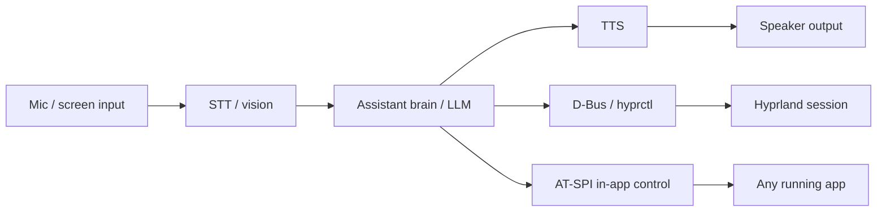

# Architecture

> The file that stops an AI from casually bypassing the design. Read at the start of every session.

## Stack
- **Base:** Arch Linux, respun with `archiso` — inherits pacman + AUR, so "all software supported" comes from the base distro, not custom work
- **Security tools:** BlackArch repository layered onto the Arch base (one `pacman.conf` entry) — the real equivalent of "integrate Kali," since Kali's Debian base can't sit on a pacman system
- **Compositor/shell base:** Hyprland (Wayland) — its animation/blur/rounded-corner pipeline delivers the cinematic look, and its IPC socket (`hyprctl`) gives the assistant a real control surface. Hyprland's native workspaces are also the backing implementation for Mission/Spaces below
- **Installer:** Calamares (graphical), so this installs like a real OS
- **Login / session lock / boot:** greetd + ReGreet under Cage for installed login, `hyprlock` + `hypridle` for `ext-session-lock-v1` locking, and Plymouth for early-boot feedback
- **Voice assistant (fresh build, not Akane's codebase):**
  - STT: TBD — Groq Whisper API (proven on Akane) or a local Whisper.cpp-class model for offline use
  - Brain: TBD — OpenRouter free-tier LLMs worked for Akane; reusing the choice isn't reusing the code
  - TTS: TBD — edge-tts (cloud) or Piper (local, CPU-friendly, fully offline)
  - App layer: GTK3 (PyGObject) + `gtk-layer-shell`, rendered as Wayland layer-shell surfaces (HUD overlay, not a normal window)
- **Windows compatibility (bolted on, not built):** Wine 11 / Bottles for general Windows apps, Proton for Steam games, QEMU/KVM as the fallback for anything with kernel-level anti-cheat or driver hooks. These projects already exist and are mature — this is integration work.
- **macOS compatibility:** does not exist as a real option (see app catalog note below) — macOS influence here is original UI inspired by its UX patterns only.

## App catalog (native vs. hosted)
Your ~90-item feature list groups into roughly **27 real native applications** — most of those items are tabs/sections inside a hub, not separate apps — plus a hosted tier. Split the way you described: things that "come with Windows" → build native; things that are "user preferences" → use the real, existing software.

**Native — built for DarkOS specifically, because they need real OS hooks:**
1. **AI Assistant** — AI, Voice, Vision, Memory, Automate, Command, Search, Studio (Studio = an advanced/pro workspace for the assistant, later phase)
2. **File Explorer** — Files, Archive
3. **Terminal**
4. **Settings** — the biggest hub; folds in System, Config, Devices, Users, Services, Startup, Storage, Fonts, Icons, Themes, Wallpaper, Motion, Designer, Permissions, Accessibility, Speech, Captions, Magnifier, Keyboard, Eye Control as tabs, not separate apps
5. **Dashboard** — Performance, Overlay
6. **Mission / Spaces** — window overview + virtual desktops, built on Hyprland's native workspaces with a custom UI on top
7. **Dock / Launcher**
8. **Widgets** — the framework powering the panel widgets seen in the reference mockup
9. **Notifications**
10. **Store** — Packages, Updates (one app, wraps pacman/AUR/flatpak)
11. **Backup / Recovery**
12. **Network Center** — Wi-Fi, Bluetooth, Connect, Cloud (integration UI only — actual cloud storage is a third-party backend)
13. **Security Center** — Vault, Privacy, Shield, Permissions, Encrypt
14. **Notes** — Editor
15. **Calendar**
16. **Clock**
17. **Calculator**
18. **Reader** (documents/PDF/e-books)
19. **Clipboard** (system-wide manager)
20. **Emoji** (picker)
21. **Gallery**
22. **Camera** — Webcam
23. **Recorder** — Capture (screen/audio)
24. **Downloads** (manager)
25. **DevHub** — Containers, Virtual Machines, Git, APIs, Plugins, Extensions — native UI wrapping hosted engines (Docker/Podman, QEMU/KVM, git, an API client)
26. **Gaming hub** — native launcher UI wrapping hosted engines (Steam/Lutris/Proton)
27. **Mail** — a basic native client, later phase. Bigger scope than it looks (IMAP/SMTP/OAuth) — same reasoning Windows and macOS both apply by shipping a simple built-in one

**Hosted — the real, existing software, used as-is (your "user preferences" tier):**
- Browser engine (Firefox/Chromium-based)
- Media playback engine (mpv/GStreamer)
- Docker/Podman, QEMU/KVM, git themselves — DevHub wraps them, doesn't replace them
- Actual games — the Gaming hub wraps Steam/Lutris/Proton, doesn't reimplement them
- Phone — tied to the Phone Companion app (backlog, its own mobile project)

No custom rebuild and no manual reskinning for the hosted tier — Hyprland's compositor draws the blur/glow/rounded-corner window chrome around any window, native or hosted, so visual consistency is free at the compositor level.

**"macOS features" — the honest version:** Mission and Spaces already cover the two most recognizable ones (Mission Control, virtual desktops), built original. There's no mature, legal Wine-equivalent for running actual macOS software on generic PC hardware — Apple's license ties macOS to Apple silicon, unlike Windows where Wine/Proton/Bottles are real and legal. Original UI inspired by macOS's patterns: yes. Running macOS binaries: not realistic, not needed.

## AI control mechanism
- OS-level actions (volume, brightness, workspaces, launching apps): D-Bus + `hyprctl`
- Generic in-app control ("self-controlling OS"): AT-SPI, Linux's accessibility API — lets the assistant read and act on any app's buttons/fields/text generically, the same mechanism screen readers and UI-testing tools use. Avoids a one-off integration per app.
- Screen understanding: periodic screenshot + vision-model call, for anything AT-SPI can't expose (custom-drawn UI, games, video)

## Folder structure
```
[TBD — will mirror archiso's standard profile layout (airootfs/, packages.x86_64, pacman.conf)
plus separate repos for the assistant, the shell, and each native app once Phase 1 exists]
```

## Boundaries (non-negotiable)
- System control goes through D-Bus / hyprctl / AT-SPI / standard CLI tools — never raw input-injection (`pyautogui`-style). Wayland's security model blocks synthetic input by design.
- The visual shell never blocks on the AI backend — if the assistant is down or offline, the HUD degrades gracefully instead of freezing the desktop.
- BlackArch tools are opt-in tool *groups* at install/setup time, not force-installed as one 2,900-package blob.
- Hosted apps are never modified or forked — they run as the upstream project ships them. Visual consistency comes from Hyprland's window decorations, not app-level changes.
- "Settings" is one app with many tabs, not 20 separate apps — resist the urge to spin up a new top-level app for every item in the original feature list.

## Data flow


## Key decisions log
- 2026-08-11: Phase 2 shell chrome uses independent TOP-layer rail, left-panel, right-panel, HUD, and dock windows; `DarkOSApplication` owns shared toggle/theme state so separately anchored surfaces cannot drift out of sync
- 2026-08-11: Session locking uses upstream `hyprlock` + `hypridle` and installed login uses greetd/ReGreet under Cage; a layer-shell overlay is not accepted as a security boundary because it does not implement `ext-session-lock-v1`
- 2026-08-11: The shell app layer is GTK3 (PyGObject) + `gtk-layer-shell`, not PyQt6; native Wayland layer-shell support matches the existing shell and avoids a parallel toolkit rewrite
- 2026-07-22: Arch respin chosen over a from-scratch OS
- 2026-07-22: BlackArch chosen over literal Kali (Debian base incompatible with pacman)
- 2026-07-22: Hyprland chosen over GNOME/KDE
- 2026-07-22: Voice assistant is a fresh build, not a port of Akane
- 2026-07-22: App strategy is native (OS-hook apps, custom-built) vs. hosted (full existing software, unmodified) — not custom vs. reskinned; compositor-level decoration gives visual consistency for free
- 2026-07-22: Windows compatibility via Wine/Proton/Bottles/QEMU; no macOS equivalent exists — macOS influence is UI patterns only (Mission, Spaces), not binary compatibility
- 2026-07-22: AI system control uses AT-SPI for generic in-app control, alongside D-Bus/hyprctl for OS-level actions
- 2026-07-22: Grouped the ~90-item feature brief into ~27 native apps/hubs — most items are settings tabs or sub-features, not standalone apps (see app catalog above)
- 2026-07-22: Narrowed Phase 1 boot support to UEFI/systemd-boot only, for now. Archiso's bootmode naming changed upstream (old `.esp`/`.eltorito`/arch-qualified names like `uefi-x64.grub` were replaced with unified `uefi.grub`/`uefi.systemd-boot`/`bios.syslinux`), and each mode needs its own supporting files (`efiboot/` for systemd-boot, a `syslinux/` directory + package for BIOS). Building and verifying one path first, before adding BIOS/GRUB back, avoids debugging three boot mechanisms at once before any of them are proven
