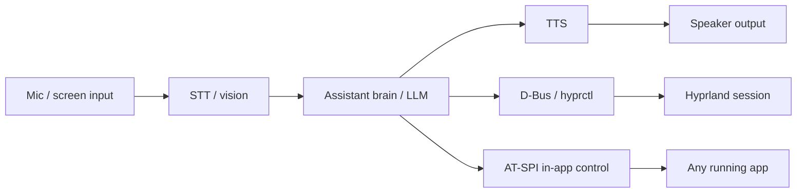

# Architecture

> The file that stops an AI from casually bypassing the design. Read at the start of every session.

## Stack
- **Base:** Arch Linux, respun with `archiso` — inherits pacman + AUR, so "all software supported" comes from the base distro, not custom work
- **Security tools:** BlackArch repository layered onto the Arch base (one `pacman.conf` entry) — the real equivalent of "integrate Kali," since Kali's Debian base can't sit on a pacman system
- **Compositor/shell base:** Hyprland (Wayland) — its animation/blur/rounded-corner pipeline delivers the cinematic look, and its IPC socket (`hyprctl`) gives the assistant a real control surface. Hyprland's native workspaces are also the backing implementation for Mission/Spaces below
- **Installer:** Calamares (graphical), so this installs like a real OS
- **Login / session lock / boot:** greetd + ReGreet under Cage for installed login, `hyprlock` + `hypridle` for `ext-session-lock-v1` locking, and Plymouth for early-boot feedback
- **Voice assistant (fresh build, not Akane's codebase):**
  - STT: Groq Whisper (`whisper-large-v3`) when a Groq key is configured, with an optional local Whisper-family command fallback
  - Brain: OpenRouter (`openrouter/free` by default) when a key is configured, with an optional local Ollama-compatible endpoint fallback
  - TTS: Groq speech when configured, then packaged eSpeak NG; optional `edge-tts` and Piper fallbacks are also supported
  - App layer: GTK3 (PyGObject) + `gtk-layer-shell`, rendered as Wayland layer-shell surfaces (HUD overlay, not a normal window)
- **Windows compatibility (source-integrated; target runtime unverified):** Wine, Steam/Lutris, and related compatibility packages are declared; Bottles and standalone Proton remain conditional on a locally installed provider. QEMU/KVM remains the fallback for anything with kernel-level anti-cheat or driver hooks. These projects already exist and are mature — this is integration work, not a claim that a Windows workload has passed on DarkOS yet.
- **Android app compatibility (source-integrated; target runtime unverified):** Waydroid is declared and exposed through a guarded Gaming Hub action. It remains a maintained LXC container running a real Android image under Wayland; container initialization and an Android-app run still need target validation. Real phone hardware (camera/cellular/sensors) stays the separate, backlogged Phone Companion project.
- **macOS compatibility:** does not exist as a real option (see app catalog note below) — macOS influence here is original UI inspired by its UX patterns only.

## App catalog (native vs. hosted)
Your ~90-item feature list groups into roughly **27 planned native applications and hubs** — most of those items are tabs/sections inside a hub, not separate apps — plus a hosted tier. The current payload contains **21 native GTK applications**, including Gaming Hub and Mail; the catalog below also retains planned hubs and shell components. Split the way you described: things that "come with Windows" → build native; things that are "user preferences" → use the real, existing software.

**Native catalog — implemented DarkOS apps, shell components, and planned hubs:**
1. **AI Assistant** — AI, Voice, Vision, Memory, Automate, Command, Search, Studio (Studio = an advanced/pro workspace for the assistant, later phase)
2. **File Explorer** — Files, Archive
3. **Terminal**
4. **Settings** — the biggest hub; folds in System, Config, Devices, Users, Services, Startup, Storage, Fonts, Icons, Themes, Wallpaper, Motion, Designer, Permissions, Accessibility, Speech, Captions, Magnifier, Keyboard, Eye Control as tabs, not separate apps. Performance currently exposes guarded daemon power profiles plus read-only CPU-governor/kernel status; kernel/scheduler package selection remains open.
5. **Dashboard** — Performance, Overlay
6. **Mission / Spaces** — window overview + virtual desktops, built on Hyprland's native workspaces with a custom UI on top
7. **Dock / Launcher**
8. **Widgets** — the framework powering the panel widgets seen in the reference mockup
9. **Notifications**
10. **Store** — Packages, Updates, Games (one app, one search surface wrapping pacman/AUR/Flatpak for native, Wine/Bottles/Proton for Windows apps and Steam games, and Waydroid for Android apps. The resolution model is implemented, but installation stays deliberately disabled until Shield can enforce its scan gate; it must not claim an install succeeded before target-system verification.)
11. **Backup / Recovery**
12. **Network Center** — Wi-Fi, Bluetooth, Connect, Cloud (integration UI only — actual cloud storage is a third-party backend)
13. **Security Center** — Vault, Privacy, Shield, Permissions, Encrypt
14. **Notes** — Editor
15. **Calendar**
16. **Clock**
17. **Calculator**
18. **Reader** (documents/PDF/e-books)
19. **Clipboard** (system-wide manager)
20. **Emoji** (picker)
21. **Gallery**
22. **Camera** — planned native hub; current webcam capture uses upstream GNOME Camera (`snapshot`)
23. **Recorder** — planned native hub; current screen/audio capture uses upstream Kooha
24. **Downloads** (manager)
25. **DevHub** — Containers, Virtual Machines, Git, APIs, Plugins, Extensions — native UI wrapping hosted engines (Docker/Podman, QEMU/KVM, git, an API client)
26. **Gaming hub** — native status and launcher UI around installed Steam/Lutris/Bottles, with Wine/Proton/Waydroid state reporting
27. **Mail** — implemented in `darkos-mail.py`: a read-only IMAPS inbox and reviewed/confirmed plain-text SMTPS sending. Account details, passwords, and drafts remain in memory for the session. Real mailbox acceptance remains open; HTML, attachments, OAuth, and persistent account storage are outside this basic implementation.

**Hosted — the real, existing software, used as-is (your "user preferences" tier):**
- Browser engine (Firefox/Chromium-based)
- Media playback engine (mpv/GStreamer)
- Geary as an additional hosted mail client, GNOME Camera (`snapshot`) for webcam capture, and Kooha for screen/audio capture
- Docker/Podman, QEMU/KVM, git themselves — DevHub wraps them, doesn't replace them
- Actual games — the Gaming hub wraps Steam/Lutris/Proton, doesn't reimplement them
- Phone — tied to the Phone Companion app (backlog, its own mobile project)

No custom rebuild and no manual reskinning for the hosted tier — Hyprland's compositor draws the blur/glow/rounded-corner window chrome around any window, native or hosted, so visual consistency is free at the compositor level.

### Current Phase 7 availability

The [2026-09-06 audit](ci/phase-7-audit.md) records the current test evidence and
open requirements. Native GTK startup tests pass in Arch/Xvfb; target ISO,
Wayland, device, and hosted-workload acceptance remain separate gates.

The ISO profile declares Firefox, mpv, Geary, GNOME Camera (`snapshot`), Kooha, Wine, Steam, Lutris, and Waydroid. `snapshot` replaces the unavailable Cheese package. `darkos-gaming.py` reads native launcher package metadata without starting Steam, discovers installed Bottles through either its native command or Flatpak ID `com.usebottles.bottles`, and reads Proton files without executing Proton. Wine configuration and Winetricks have guarded launch actions; Waydroid checks for an existing session and reports setup requirements or command failures. Bottles and standalone Proton remain conditional local installations.

`darkos-mail.py` implements the basic native Mail requirement in source: certificate-verified implicit TLS for IMAP/SMTP, read-only inbox previews, and an explicit message review before submission. Credentials and drafts are session-only. The 21 native GTK applications have automated startup coverage, but this does not establish real mailbox delivery, hosted workload compatibility, Wayland rendering, or device acceptance.

Settings Performance uses `powerprofilesctl list` and `get` before exposing supported `performance`, `balanced`, and `power-saver` choices. An explicit Set action rechecks availability, invokes `set` under the packaged polkit policy, and reads back the actual profile; failures and mismatches remain visible. Calls run outside GTK with time limits. Power-profile controls do not implement the separate kernel/scheduler package-choice requirement.

**"macOS features" — the honest version:** Mission and Spaces already cover the two most recognizable ones (Mission Control, virtual desktops), built original. There's no mature, legal Wine-equivalent for running actual macOS software on generic PC hardware — Apple's license ties macOS to Apple silicon, unlike Windows where Wine/Proton/Bottles are real and legal. Original UI inspired by macOS's patterns: yes. Running macOS binaries: not realistic, not needed.

## Security & antivirus
Security Center (app #13) gets a real engine behind "Shield," not just a settings UI:

Current implementation: cancellable on-demand ClamAV file/folder scans and a
user-triggered definitions updater. Real engine checks with a harmless local
signature pass. The continuous-protection, integrity, quarantine, and Store
gate requirements below are still open; manual scans do not fulfill them.
- **Malware scanning:** ClamAV as the on-demand/scheduled engine (signature-based, open-source, actively maintained) + `freshclam` for signature updates
- **On-access scanning:** `inotify`-based watcher flags new/modified files for a background scan instead of polling the whole disk (switched from the originally-planned fanotify — see 2026-09-11 decision below)
- **Rootkit / integrity checks:** rkhunter-style heuristic checks + AIDE for file-integrity baselining, surfaced as a visible "Shield" scan result
- **Quarantine, not silent delete:** flagged files move to a quarantine folder with one-click restore — false positives are normal for heuristic AV, and silent deletion loses user trust and data
- **Network transparency dashboard:** plain-language view of what's phoning home right now, per app — PHANTOM's monitoring core repurposed, not new groundwork
- All of this runs local-only, initiated by and visible to the device's own user — ties into the Boundaries entry below

## AI control mechanism
- OS-level actions (volume, brightness, workspaces, launching apps): D-Bus + `hyprctl`
- Generic in-app control ("self-controlling OS"): AT-SPI, Linux's accessibility API — lets the assistant read and act on any app's buttons/fields/text generically, the same mechanism screen readers and UI-testing tools use. Avoids a one-off integration per app.
- Screen understanding: periodic screenshot + vision-model call, for anything AT-SPI can't expose (custom-drawn UI, games, video)
- **Snapshot-before-act:** any AI action beyond trivial (installs, file/system changes, settings edits) triggers a Btrfs/ZFS snapshot first — a real system-wide "undo that," not just per-file undo. Non-negotiable given the assistant can act autonomously — this is a safety requirement, not a nice-to-have
- **Explain this, anywhere:** right-click any error, crash log, or notification → AT-SPI pulls the text, AI explains it and offers a fix inline. No mainstream OS does this at the system level
- **Context-aware shell:** AI reads the foreground app + activity pattern (coding/gaming/writing) via the same AT-SPI signal and swaps Dock/panel layout automatically — an assistive layout change, not an autonomous system action, so it doesn't need the snapshot step above

## DarkOS Cloud (services & data)
Resolves the 2026-08-17 open question: "server controls client" = a services/data backend, not remote control of the device. The client always initiates; the server never reaches in.

- **Account & license:** which tier a given install is entitled to — the real "is this a paid copy" check
- **Cloud AI tier (paid):** hosted brain for devices too weak for a good local model — same Groq/OpenRouter-class APIs already planned in Stack above, just gated by tier instead of free-for-everyone. Directly useful given your own dev machine's local ceiling (~3B Q4)
- **AI training data (disclosed, time-boxed):** conversations sent to the cloud AI can be used to improve the model — disclosed in the privacy policy up front, collected in defined batches/windows rather than kept forever, and scoped strictly to what the client sent the AI. Never extended to other device data (files, local activity, anything the user didn't send to the AI). A "not used for training" guarantee is a natural higher-tier perk later if you want one.
- **Sync / backup (opt-in, paid):** settings, Notes, files — encrypted, off by default, user turns it on
- **Update distribution:** signed release manifests the client pulls on its own schedule — same model as pacman mirrors or Windows Update, not a push channel
- **Remote support (opt-in, per-session):** for direct help on a customer's machine, they generate a support code locally and hand it to you — time-limited, with a visible "session active" indicator the whole time. Same pattern as AnyDesk/TeamViewer/Chrome Remote Desktop. This is the one place anything resembling "control" is real, and it only exists because the user started it, in front of them
- **Stored server-side:** account/license state, plus whatever the user opted into (sync/backup, crash reports if enabled) — not a standing log of everything the device does; nothing above needs that
- **Stack:** Supabase covers the account + Postgres + storage shape and is already your pattern on PHANTOM and Akane. The backend framework (FastAPI vs. Rust/Axum) remains a future cloud-service decision.

## Folder structure
```
.
├── airootfs/                    # ISO payload
│   ├── etc/xdg/                 # Hyprland, Waybar, and related desktop config
│   ├── usr/local/bin/           # Shell runtime, native GTK apps, and helper scripts
│   └── usr/share/applications/  # Desktop launchers
├── ci/                          # Build and ISO-verification helpers
├── packages.x86_64              # Arch packages declared for the ISO profile
├── pacman.conf                  # Repository configuration
├── profiledef.sh                # ArchISO profile definition
└── build-iso.sh                 # Local build wrapper
```

## Boundaries (non-negotiable)
- System control goes through D-Bus / hyprctl / AT-SPI / standard CLI tools — never raw input-injection (`pyautogui`-style). Wayland's security model blocks synthetic input by design. This covers remote/networked control too: no server-side channel lets anyone but the device's own user drive that device — DarkOS Cloud (above) is client-initiated service requests plus opt-in, user-started support sessions, never a standing control channel.
- The visual shell never blocks on the AI backend — if the assistant is down or offline, the HUD degrades gracefully instead of freezing the desktop.
- BlackArch tools are opt-in tool *groups* at install/setup time, not force-installed as one 2,900-package blob.
- Hosted apps are never modified or forked — they run as the upstream project ships them. Visual consistency comes from Hyprland's window decorations, not app-level changes.
- "Settings" is one app with many tabs, not 20 separate apps — resist the urge to spin up a new top-level app for every item in the original feature list.

## Data flow


## Key decisions log
- 2026-09-11: On-access scanning switched from fanotify to inotify — the 2026-08-17 entry below flagged that fanotify "remains unimplemented pending a real kernel/filesystem validation environment," and that validation is exactly what ruled it out: `fanotify_init`/`fanotify_mark` reported success but never delivered a single real event in testing (confirmed with a blocking read against a real file write, not a timing fluke), while the identical test against inotify worked immediately. inotify also doesn't need CAP_SYS_ADMIN, so continuous protection runs as the desktop user instead of needing its own root-owned service. Real downside: inotify doesn't auto-discover new subdirectories under a watched parent either, so removable-media coverage still needs a udev/poll loop calling the watcher's rescan() — not yet built.
- 2026-09-06: Added basic native Mail with session-only credentials/drafts, read-only IMAPS, and confirmed text-only SMTPS submission; a real mailbox test remains pending. The payload now contains 21 native GTK applications. GNOME Camera (`snapshot`) replaces Cheese in the hosted tier. Settings gained guarded daemon power-profile selection with readback; kernel/scheduler package choice remains open. These changes supersede earlier implementation-status notes without changing their historical test evidence.
- 2026-08-23: Implemented the Command Center split — dock + rail stay always-on, `DarkOSHUDOverlay` + left + right panels now start hidden and open together via `--toggle-command-center` (SUPER+H — SUPER+C was already `killactive`). While wiring this, found `DarkOSHUDOverlay` was defined and imported but **never instantiated** — Phase 2's "Central AI Core HUD: done, VM-verified 2026-08-16" checkbox did not match what actually ran. Wiring was fixed that day, and the real Cairo ring HUD landed on 2026-08-26; its target-session rendering remains unverified. Phase 5 now has code, but two related commitments remain open: Network Center's real KDE-Connect-protocol phone integration (Zorin Connect-inspired), and Settings > System's kernel/scheduler + CPU-governor Performance profile (CachyOS-inspired), folded into Phase 8's first-run flow.
- 2026-08-17: Added 5 differentiators no mainstream OS ships: snapshot-before-act system-wide undo, system-wide "explain this," a network transparency dashboard (reused from PHANTOM), context-aware shell modes, and a unified Store covering native + Windows + Android apps/games in one search bar
- 2026-08-17: Added Android app compatibility via Waydroid (mobile part of the "install anything" ask); Windows/Linux already covered, macOS stays out of scope (unchanged — no legal compat layer exists, see project-overview.md)
- 2026-08-17: Defined the intended Security Center Shield engine — ClamAV + fanotify on-access scanning + rkhunter/AIDE integrity checks + quarantine (not silent delete). This remains unimplemented pending a real kernel/filesystem validation environment.
- 2026-08-17: Client/server ask resolved as DarkOS Cloud — a services/data backend (accounts, license tiers, cloud AI, opt-in sync, signed updates, opt-in per-session remote support), not remote control of the device; client always initiates — see § DarkOS Cloud
- 2026-08-11: Phase 2 shell chrome uses independent TOP-layer rail, left-panel, right-panel, HUD, and dock windows; `DarkOSApplication` owns shared toggle/theme state so separately anchored surfaces cannot drift out of sync
- 2026-08-11: Session locking uses upstream `hyprlock` + `hypridle` and installed login uses greetd/ReGreet under Cage; a layer-shell overlay is not accepted as a security boundary because it does not implement `ext-session-lock-v1`
- 2026-08-11: The shell app layer is GTK3 (PyGObject) + `gtk-layer-shell`, not PyQt6; native Wayland layer-shell support matches the existing shell and avoids a parallel toolkit rewrite
- 2026-07-22: Arch respin chosen over a from-scratch OS
- 2026-07-22: BlackArch chosen over literal Kali (Debian base incompatible with pacman)
- 2026-07-22: Hyprland chosen over GNOME/KDE
- 2026-07-22: Voice assistant is a fresh build, not a port of Akane
- 2026-07-22: App strategy is native (OS-hook apps, custom-built) vs. hosted (full existing software, unmodified) — not custom vs. reskinned; compositor-level decoration gives visual consistency for free
- 2026-07-22: Windows compatibility via Wine/Proton/Bottles/QEMU; no macOS equivalent exists — macOS influence is UI patterns only (Mission, Spaces), not binary compatibility
- 2026-07-22: AI system control uses AT-SPI for generic in-app control, alongside D-Bus/hyprctl for OS-level actions
- 2026-07-22: Grouped the ~90-item feature brief into ~27 native apps/hubs — most items are settings tabs or sub-features, not standalone apps (see app catalog above)
- 2026-07-22: Narrowed Phase 1 boot support to UEFI/systemd-boot only, for now. Archiso's bootmode naming changed upstream (old `.esp`/`.eltorito`/arch-qualified names like `uefi-x64.grub` were replaced with unified `uefi.grub`/`uefi.systemd-boot`/`bios.syslinux`), and each mode needs its own supporting files (`efiboot/` for systemd-boot, a `syslinux/` directory + package for BIOS). Building and verifying one path first, before adding BIOS/GRUB back, avoids debugging three boot mechanisms at once before any of them are proven
